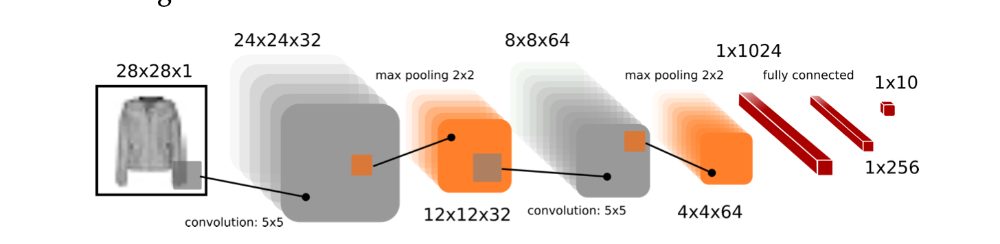
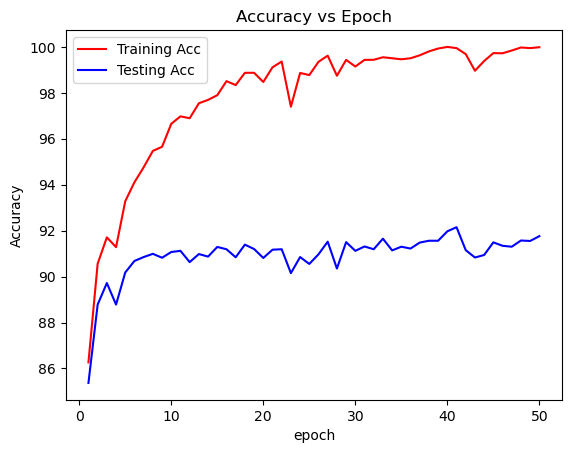
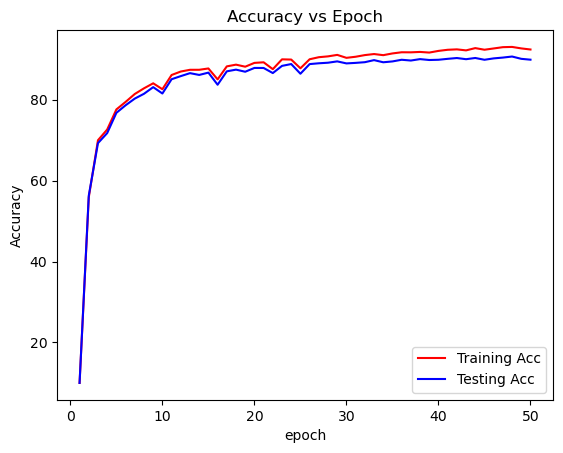
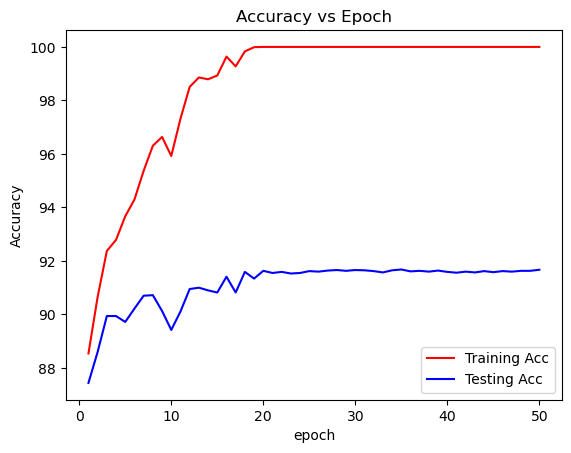

# Project: Impact of Activation Functions on CNN Performance for Clothing Classification

## Project Overview

This project systematically studies a **multi-class classification problem** on Fashion-MNIST clothing images while analyzing how **different activation functions** affect model convergence, accuracy, and generalization.

## Project Aims

1. **Solve clothing classification** (10 classes: T-shirt, Trouser, Pullover, Dress, Coat, Sandal, Shirt, Sneaker, Bag, Ankle boot)
2. **Experimentally compare** ReLU, Tanh, Sigmoid, ELU, and ReLU+Dropout effects on classification performance
3. **Quantify activation impact** on training dynamics, final accuracy, and overfitting behavior

## Classification Problem Setup

Dataset: Fashion-MNIST (60K train, 10K test, 28×28 grayscale)

Task: Map image → 1 of 10 clothing classes

CNN: Conv(1→32→64) + FC(1024→256→10)

Metrics: Cross-Entropy Loss, Top-1 Accuracy

Loss: CrossEntropyLoss()

Optimizer: SGD (lr=0.1)

Epochs: 50

## Model Architecture

## Activation Function Experiments

| Variant | Activation     | Purpose                  | Expected Classification Impact                  |
|---------|----------------|------------------------|------------------------------------------------|
| **1**   | ReLU           | Baseline (fastest)      | Best accuracy, quick convergence                |
| **2**   | Tanh           | Zero-centered           | Moderate accuracy, slower learning              |
| **3**   | Sigmoid        | Logistic baseline       | Poor accuracy (vanishing gradients)             |
| **4**   | ELU            | Smooth ReLU             | Strong accuracy, stable training                |
| **5**   | ReLU+Dropout   | Regularized             | Best generalization (p=0.2 dropout)             |

## Methodology

Xavier Uniform initialization for fair comparison

Train each variant for 50 epochs

Track metrics: loss_epoch_array, train_accuracy, valid_accuracy

Evaluation in eval() mode on train/test sets

Log: "Epoch X: loss: Y, train acc: Z%, valid acc: W%"

## Research Questions

1. Which activation maximizes classification accuracy on clothing images?
2. How do gradient flow differences affect multi-class convergence?
3. Does regularization (dropout) improve generalization across activations?
4. What are the trade-offs between convergence speed vs final accuracy?

## Expected Results Template

**Classification Performance Comparison:**

| Activation   | Final Val Acc | Epochs to 90% | Overfit Gap (Train-Val) | 
|--------------|---------------|---------------|-------------------------|
| ReLU         |    91.76      | 8             |      8.225              |                   
| Tanh         |    91.67      | 11            |      8.33               |                   
| Sigmoid      |    89.91      | 38            |  2.51                   |                   
| ELU          |   NAN         | NAN           |  NAN                    |                   
| ReLU+Dropout |    90.98      |   6           |   9                     |                  

### Accuracy vs Epoch for different activation
Using Relu+dropout activation function

Using Relu activation function

Using Sigmod activation function

Using tanh activation function
 

## Project Deliverables

- ✅ Complete training code with 5 activation variants

- ✅ Loss/accuracy tracking for experiments

- 📊 Comparative learning curves & metrics table

- 💡 Production CNN recommendations